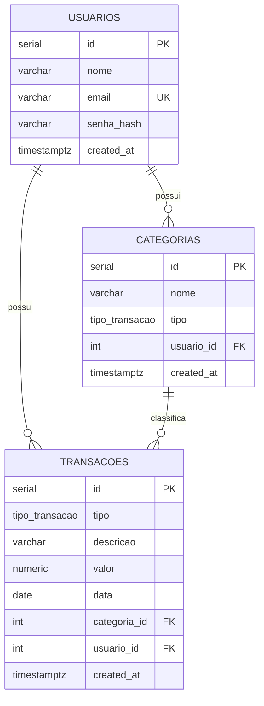

# Modelagem do Banco de Dados

## Entidades

- **usuarios** — contas do sistema (autenticação, Milestone 4)
- **categorias** — organizam as transações; pertencem a um usuário; têm um `tipo` (RECEITA ou DESPESA)
- **transacoes** — tabela única para receitas e despesas, diferenciadas pela coluna `tipo`

## Diagrama ER

## Decisões de design

| Decisão | Motivo |
|---|---|
| `transacoes` única (não `receitas`/`despesas` separadas) | Evita duplicação de schema e de código de CRUD; simplifica queries do dashboard (`SUM(valor) GROUP BY tipo`) |
| `valor NUMERIC(12,2)`, não `FLOAT` | Ponto flutuante tem erro de arredondamento — inaceitável para valores monetários |
| `tipo` como ENUM nativo (`tipo_transacao`) | Banco recusa qualquer valor fora de `RECEITA`/`DESPESA` — validação na própria camada de dados |
| `categorias`: `UNIQUE (usuario_id, nome, tipo)` | Impede duplicar a mesma categoria para o mesmo usuário |
| `transacoes.categoria_id` → `ON DELETE RESTRICT` | Impede apagar categoria com transações vinculadas (protege histórico) |
| `usuarios.id` → `ON DELETE CASCADE` nas tabelas filhas | Remover um usuário remove seus dados associados |

## Próximo passo

O schema SQL (`schema.sql`) nesta mesma pasta é o DDL de referência para entender a estrutura.
No Milestone 3, esse schema será recriado via **SQLAlchemy models + Alembic migrations**,
que passam a ser a fonte de verdade — este arquivo fica como documentação e para validação manual.
